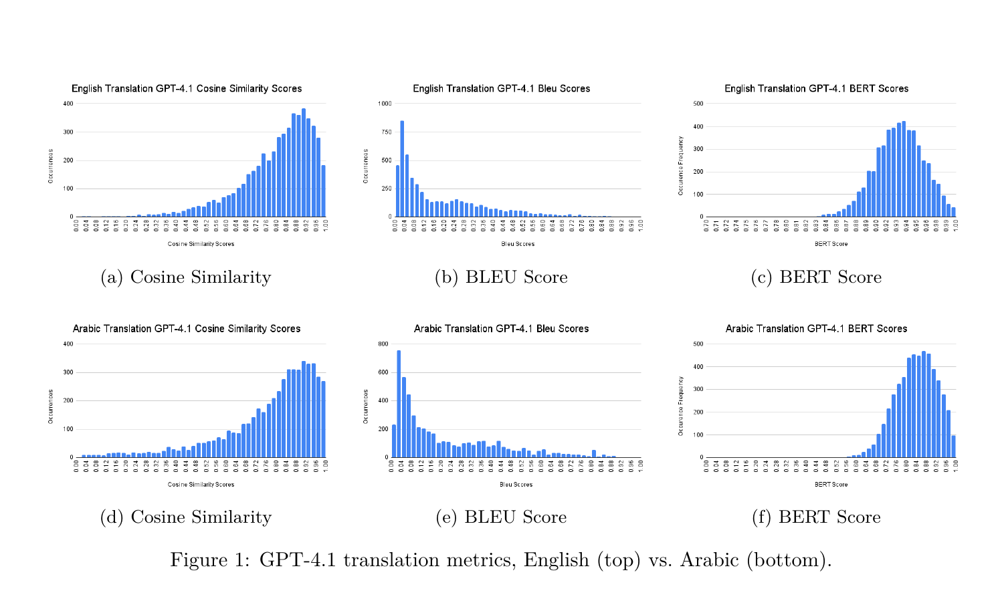
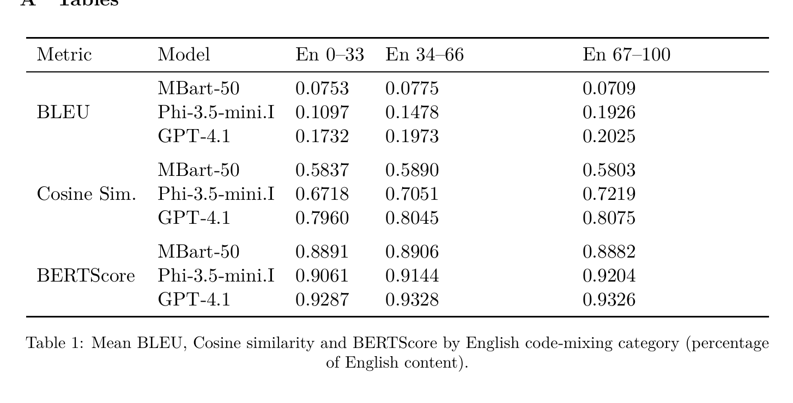
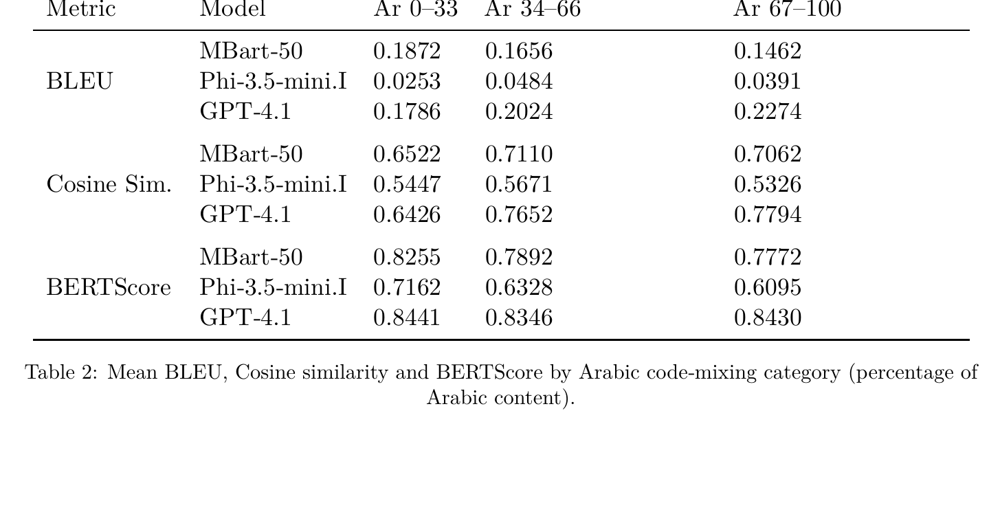

# SaintLingual: Benchmarking LLMs on English-Arabic Code-Switched Translation

A multilingual NLP research project that builds a human-validated English-Arabic code-switched dataset and benchmarks large language model translation performance using BLEU, cosine similarity, and BERTScore.

Models evaluated: GPT-4.1, MBart-50, and Phi-3.5-mini.

---

## Overview

SaintLingual explores how well modern language models handle **English-Arabic code-switching**, where speakers alternate between both languages within the same sentence. While many translation systems perform well on clean monolingual text, real-world multilingual communication is often code-mixed, informal, and context-dependent.

To study this problem, this project creates a curated English-Arabic code-mixed dataset and evaluates multiple models on their ability to translate these mixed-language inputs accurately and consistently.

This project demonstrates experience in:

- NLP experimentation and benchmarking
- Dataset construction and validation
- LLM evaluation
- Multilingual text processing
- Research analysis and technical communication

---

## Why This Project Matters

Code-switching is common across multilingual communities, but it remains underrepresented in standard NLP benchmarks. This creates a gap between how language technologies are typically evaluated and how people actually communicate.

SaintLingual helps address that gap by:

- creating a benchmark for English-Arabic code-switched translation
- comparing model robustness on mixed-language inputs
- analyzing how performance changes across different language-mixing conditions
- highlighting current limitations of multilingual and general-purpose LLMs

For recruiters and technical reviewers, this project shows applied experience with end-to-end NLP research, from dataset generation to evaluation and result interpretation.

---

## Results Snapshot

### Example Performance Visualization

### English Translation Metrics

### Arabic Translation Metrics

---

## Project Workflow

This project follows a simple benchmarking pipeline:

1. Start with aligned English-Arabic sentence pairs  
2. Generate code-switched variants with controlled language mixing  
3. Validate outputs for quality and naturalness  
4. Translate the code-mixed inputs with multiple models  
5. Evaluate outputs across several metrics  
6. Compare performance by model and mixing condition

---

## Methodology

### 1. Dataset Construction

The dataset was built from aligned English-Arabic sentence pairs and transformed into code-switched examples that reflect intra-sentential language mixing. The goal was to create realistic mixed-language inputs rather than purely synthetic token replacements.

The dataset includes both:

- **Arabic-dominant code-switched sentences**
- **English-dominant code-switched sentences**

Additional metadata such as percentage composition and bins were included to support more structured evaluation.

### 2. Translation Generation

Each benchmarked model was used to translate the code-mixed inputs. The project compares how well the models preserve meaning when handling mixed-language sentences that are more challenging than standard monolingual translation inputs.

### 3. Evaluation Metrics

Model outputs were evaluated using:

- **BLEU** for surface-level overlap
- **Cosine Similarity** for semantic similarity
- **BERTScore** for contextual alignment

Using multiple evaluation metrics helps capture both literal correctness and semantic preservation.

---

## Models Evaluated

The benchmark compares the following models:

- **GPT-4.1**
- **MBart-50**
- **Phi-3.5-mini**

These models were selected to compare performance across different model families and capabilities on a code-switched translation task.

---

## Key Findings

Some of the main takeaways from this project include:

- stronger LLMs performed better at preserving meaning across code-mixed inputs
- performance varied depending on the degree and style of code-switching
- heavily mixed and less structured examples were more difficult for all models
- semantic metrics were useful for identifying cases where exact lexical overlap was low but meaning was still partially preserved

Overall, the benchmark shows that code-switched translation remains a challenging setting, even for strong modern language models.

---

## Repository Structure

This repository contains the following files and directories:

- **Project.ipynb**  
  Notebook used to generate and prepare the code-mixed dataset.

- **Translate.ipynb**  
  Notebook used to generate translations for the benchmark dataset.

- **new_benchmark.ipynb**  
  Notebook used to calculate evaluation metrics for all model outputs.

- **Full_Dataset_with_pct_and_bins.csv**  
  Complete generated dataset, including percentage information and bins.

- **Benchmark_Results/**  
  Directory containing model evaluation results, metric outputs, and corresponding sentence-level examples.

- **images/**  
  README assets including tables and visualizations from the project report.

---

## Dataset Availability

The generated dataset is also available on Hugging Face:

**Hugging Face:**  
[ArzEn-CodeMixed Dataset](https://huggingface.co/datasets/taha-alnasser/ArzEn-CodeMixed)

---

## Example Use Cases

This project is relevant for:

- multilingual NLP benchmarking
- machine translation evaluation
- code-switched language research
- LLM robustness analysis
- low-resource and mixed-language text applications

---

## Technical Skills Demonstrated

- Python
- Jupyter / Colab
- NLP evaluation
- Dataset engineering
- LLM benchmarking
- Experimental design
- Multilingual text analysis
- Research documentation and reporting

---

## Future Improvements

Potential next steps for this project include:

- evaluating additional multilingual and open-source models
- expanding to more code-switched language pairs
- increasing human review and annotation coverage
- improving qualitative error analysis
- testing model performance on conversational and longer-form code-switched inputs

---

## Authors

- Chiemeka Nwakama
- Taha Alnasser
- Lily Li
- Ibrahim Ismail-Adebiyi